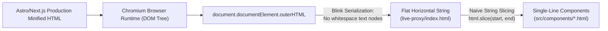
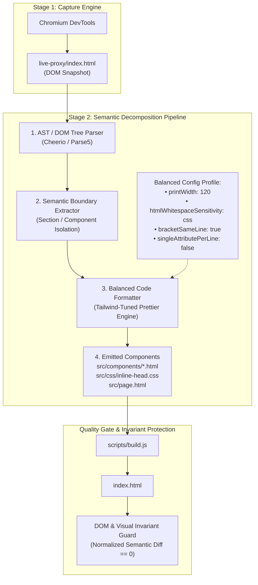

# Architectural Solution: Balanced Code Formatting in Component Decomposition

เอกสารบันทึกข้อเสนอเชิงสถาปัตยกรรม (Architectural Proposal & Permanent Solutions) สำหรับการแก้ไขปัญหา Code Formatting ในขั้นตอน **Component Decomposition (Stage 2)** เพื่อป้องกันปัญหาโค้ดถูกบีบอัดเป็นแนวนอน (Horizontal Format) หรือกระจายบรรทัดจนเกินพอดี (Over-split) อย่างถาวร

---

## 1. ที่มาและสภาพปัญหา (The Problem)

ในขั้นตอนการนำโค้ดจาก **Stage 1 (Live-Proxy Snapshot)** มาทำการแยกส่วนประกอบเป็น **Stage 2 (Component Decomposition)** เช่น การสร้าง `src/components/*.html`, `src/page.html` และ `src/css/*.css` พบปัญหาสำคัญด้านคุณภาพของโค้ด:

* **Horizontal Formatting (Over-compression)**: โค้ดในแต่ละไฟล์ component มีความยาวหลายพันถึงหมื่นตัวอักษรต่อบรรทัด (เช่น `pricing.html` 19.1 KB ใน 1 บรรทัด, `faq.html` 17.1 KB ใน 1 บรรทัด, `benefits.html` 14.1 KB ใน 1 บรรทัด)
* **สูญเสียความสามารถในการดูแลรักษา (Loss of Maintainability)**: Developer ไม่สามารถอ่าน, ทำความเข้าใจ, หรือแก้ไขโค้ดในลักษณะ Diff / Git commit ได้อย่างมีประสิทธิภาพ
* **ความล้มเหลวของการจัดระเบียบเดิม**: การใช้ string slicing ตัดโค้ดดิบ (`html.slice(start, end)`) ทำให้มรดกความบีบอัดจาก Production Minification ของเว็บต้นทางติดมายัง Component ทันที

---

## 2. การวิเคราะห์สาเหตุเชิงลึก (Root Cause Analysis)



1. **Chromium DOM Serialization (`Element.outerHTML`)**:
   - หน้าเว็บต้นทางที่สร้างจาก Modern Frameworks (เช่น Astro, Next.js, Vite) ทำการ Minify HTML มาตั้งแต่ Production Build
   - เมื่อ Chromium โหลด DOM Tree และรัน JavaScript/Hydration ครบถ้วน แล้วถูกดึง string ผ่าน `outerHTML` ตัวเอนจิน Serialization (Blink) จะแปลงเฉพาะ Node ที่มีอยู่จริง
   - เมื่อไม่มี Text Node ที่เป็นช่องว่างหรือ Newline (`\n`) คั่นกลางระหว่าง Element ตัวเบราว์เซอร์จะไม่สร้าง Indentation หรือ Line Break ให้เลย ผลลัพธ์จึงเป็น Flat String ต่อกันเป็นพืด
2. **Decomposition ทำงานระดับ Text-level (Naive String Slicing)**:
   - สคริปต์ Decomposer ค้นหาตำแหน่ง tag ผ่าน `indexOf()` แล้วตัดก้อน string เขียนลง disk โดยตรง
   - ขาด **Transformation & Formatting Layer** คั่นกลางระหว่างการ Extract กับการ Emit ไฟล์
3. **Minified Inlined Assets**:
   - แท็ก `<style>` และ JavaScript ใน Head ถูก Minify รวมกันเป็นบรรทัดเดียว เมื่อแยกออกมาเป็น `inline-head.css` จึงอยู่ในสภาพบรรทัดเดียวยาวเหยียด
4. **Toolchain Disconnect ใน Sandbox Environment**:
   - ระบบ Sandbox Container ที่ใช้รัน Chrome/Node ขาดเครื่องมือจัดระเบียบโค้ดที่ผูกเป็น Native Hook ทำให้ไม่มีกระบวนการ Auto-format ในช่วง Post-Write

---

## 3. ความท้าทาย: กับดัก Over-split vs Over-compress ในยุค Tailwind CSS

การแก้ปัญหา Formatting ในหน้าเว็บยุคใหม่ที่มีการใช้งาน **Tailwind CSS** และ **SVG Icons** ไม่สามารถใช้ตัวจัดระเบียบค่าเริ่มต้น (Default Prettier) ได้โดยตรง เนื่องจากจะเกิดสภาวะสุดโต่ง 2 ฝั่ง:

| สภาวะ | พฤติกรรม | ผลกระทบ |
| :--- | :--- | :--- |
| **Over-compression (ปัจจุบัน)** | ทุกแท็กติดกันเป็นแถวแนวนอนยาวหลายพันตัวอักษร | อ่านโครงสร้าง DOM Hierarchy ไม่ได้เลย |
| **Over-split (Default Prettier `printWidth: 80`)** | แตกทุก Attribute และ Class ของ Tailwind ออกเป็น 1 บรรทัดต่อ 1 ค่า | Tag `<a>` หรือ `<div>` ธรรมดาถูกระเบิดยาว 20-30 บรรทัด โครงสร้างโดยรวมรกและยาวเกินจำเป็น |

**เป้าหมาย (Balanced Formatting Standard):**
* **Do not unnecessarily split simple code across many lines** (ไม่แตกบรรทัดพร่ำเพรื่อกับแท็กเรียบง่าย)
* **Do not compress complex code into overly long lines** (ไม่บีบอัดโค้ดที่ซับซ้อนให้ยาวเหยียดในแถวเดียว)
* **Maintain a clean, consistent, and readable structure** (รักษาโครงสร้าง Hierarchy และ Indentation ที่สะอาดตา)

---

## 4. โครงสร้างสถาปัตยกรรมถาวร (Permanent Architectural Solution: 4 เสาหลัก)



---

### เสาหลักที่ 1: AST-Aware Semantic Extraction (เปลี่ยนจาก String สู่ Node Tree)
แทนที่จะใช้ `html.indexOf()` และ `html.slice()`:
* นำ DOM Parser ที่มี AST Awareness (เช่น `parse5`, `posthtml`, หรือ `cheerio`) มา parse Snapshot HTML
* เข้าถึง Element ตาม Semantic Selector (เช่น `section#hero`, `nav`, `section#pricing`)
* ดึง subtree ออกมาในรูปของ DOM Node Fragment ซึ่งทำให้สามารถ Cleanse, Strip runtime attributes ที่ไม่จำเป็น, หรือปรับแต่ง Attribute ได้อย่างปลอดภัยก่อนบันทึก

---

### เสาหลักที่ 2: Native Sandbox Formatting Gateway
* ติดตั้งเครื่องมือ Format ระดับ Node.js (`prettier` ร่วมกับ `@prettier/plugin-html` และ `prettier-plugin-tailwindcss`) เป็นส่วนหนึ่งของ Base Image หรือ Core Toolchain ใน Sandbox Container
* สร้าง **Post-Generation Interceptor Hook**: เมื่อ Decomposer เตรียมจะปล่อยไฟล์ (Emit) ลงระบบไฟล์:
  ```javascript
  async function emitComponent(filePath, rawContent, type = 'html') {
    const formatted = await formatWithBalancedProfile(rawContent, type);
    fs.writeFileSync(filePath, formatted, 'utf8');
  }
  ```

---

### เสาหลักที่ 3: Balanced Formatting Profile Configuration
กำหนดกฎการจัดรูปทรงให้รองรับ Component ยุคใหม่ที่มี Utility Class ยาว:

#### สำหรับ HTML Components (`.prettierrc.json`):
```json
{
  "parser": "html",
  "printWidth": 120,
  "tabWidth": 2,
  "useTabs": false,
  "htmlWhitespaceSensitivity": "css",
  "bracketSameLine": true,
  "singleAttributePerLine": false,
  "proseWrap": "preserve"
}
```

#### หลักการจัดรูปทรงของ Profile นี้:
1. **Vertical DOM Nesting**: Block elements (`<section>`, `<div>`, `<header>`, `<ul>`, `<form>`) จะถูกตัดขึ้นบรรทัดใหม่และ Indent 2 spaces เสมอตามระดับชั้น
2. **Inline Elements Protection**: Inline elements สั้น ๆ (`<a href="...">Text</a>`, `<span class="...">...</span>`, `<button>...</button>`) จะไม่ถูกระเบิดเป็นหลายบรรทัดหากความยาวไม่เกิน 120 ตัวอักษร
3. **Tailwind Class Preservation**: คลาส Utility จะเรียงต่อกันในบรรทัดเดียวกัน เว้นแต่จะเกิน 120 ตัวอักษรจึงจะ wrap อย่างเป็นระเบียบ
4. **CSS Rule Expansion**: กฎใน `inline-head.css` จะถูกคลายออกเป็นโครงสร้างมาตรฐาน (1 rule ต่อ 1 บล็อก, 1 property ต่อ 1 บรรทัด)

---

### เสาหลักที่ 4: Semantic & Visual Invariant Guard (หลักประกันความถูกต้อง)
การจัด Format ใน HTML มีความเสี่ยงต่อการเกิด Layout Bug หากเกิด Whitespace ระหว่าง Inline Elements (เช่น ช่องว่าง 4px ระหว่าง `inline-block` หรือผลของ `pre-line`)

**กลไก Guard:**
1. **Normalized DOM Tree Comparison**:
   - นำ `live-proxy/index.html` และผลลัพธ์หลัง Build `decomposition/index.html` มา parse เป็น DOM Tree
   - ตัด whitespace ระหว่าง tag ออก (Normalize) แล้วเปรียบเทียบ Tree Structure
   - ต้องได้โครงสร้าง DOM, Attributes, และ Text Content ตรงกัน 100%
2. **Automated Visual Regression Test**:
   - รัน Capture Screenshot ผ่าน Headless Chrome ที่ Port `4176` (Live-Proxy) เทียบกับ Port `4177` (Decomposition)
   - ความต่างของ Pixel Diff ต้องเป็น 0% (หรือต่ำกว่า threshold ของ dynamic timestamp)

---

## 5. การเปรียบเทียบเชิงสถาปัตยกรรม (Architecture Comparison)

| มิติ | Immediate Fix (ทำเฉพาะหน้า) | Permanent Architectural Solution (โซลูชันถาวร) |
| :--- | :--- | :--- |
| **วิธีการ** | ใช้ regex หรือรัน beautify ปรับไฟล์เฉพาะกิจหลังพบปัญหา | วาง Formatting Gateway ใน Pipeline การ Decompose ตั้งแต่ต้น |
| **ความครอบคลุม** | ได้ผลเฉพาะไฟล์ปัจจุบันที่สั่งแก้ | ครอบคลุมทุกแอพ ทุก Component ที่จะถูก Decompose ในอนาคต |
| **คุณภาพผลลัพธ์** | เสี่ยงต่อ Over-split หรือ Whitespace layout เพี้ยน | ควบคุมด้วย Balanced Profile และมี Invariant Guard ตรวจสอบ |
| **Developer Experience** | ต้องมีคำสั่ง manual แทรกทุกครั้ง | Zero-touch: โค้ดที่ได้พร้อม Commit และทำ Code Review ทันที |

---

## 6. แนวทาง Roadmap การ Implement

1. **Phase 1: Toolchain Setup in Sandbox**
   - ตรวจสอบและฝัง `prettier` + plugins ใน Environment ของ Sandbox ให้เรียกใช้งานผ่าน Node.js ได้อย่างเสถียร
2. **Phase 2: Decomposition Engine Template**
   - สร้างโมดูล `formatPipeline.js` ที่ฝัง Configuration ชุด Balanced Profile ไว้ในโฟลเดอร์ `scripts/` ของโปรเจกต์ Decompose
   - ให้สคริปต์ Decompose ส่งออกผ่าน `formatPipeline.js` ทุกครั้งก่อน `fs.writeFileSync`
3. **Phase 3: Integration into Automation MCP Tools**
   - เมื่อถึงขั้นตอนการทำ Automate Tool สำหรับ Component Decomposition ให้นำ Pipeline ชุดนี้ไปเป็น Core Transform Engine อัตโนมัติ
