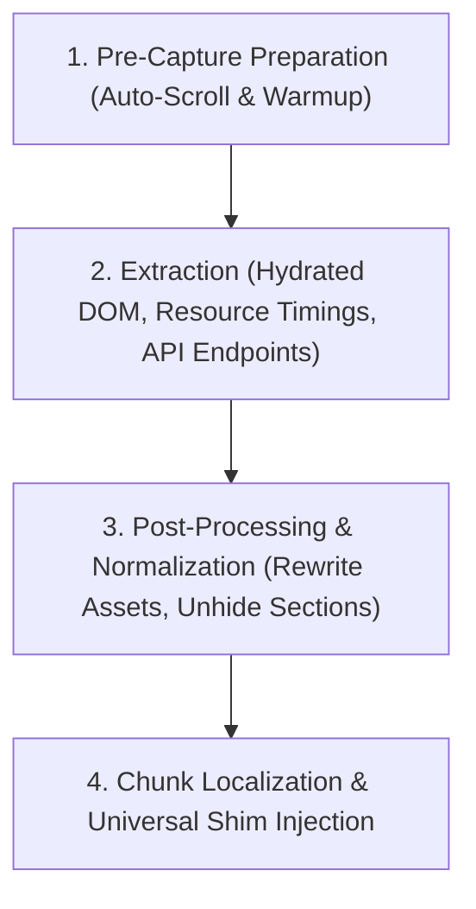

# Architecture & Implementation: Universal Live-Proxy Snapshot Tool

**Date:** 2026-10-10  
**Tool Name:** `create_live_proxy_snapshot`  
**Module:** [`src/local_mcp_server/clone/live_proxy.py`](file:///home/kawee/Code/project/openai-secure-mcp-tunnel/src/local_mcp_server/clone/live_proxy.py)  
**Registered in:** [`src/local_mcp_server/clone/tools.py`](file:///home/kawee/Code/project/openai-secure-mcp-tunnel/src/local_mcp_server/clone/tools.py)  
**Status:** Implemented, Tested, & Verified in Production Container  

---

## 1. วัตถุประสงค์ (Objective)
สร้าง Universal Tool ที่สามารถโคลนหน้าเว็บจาก Active Browser Tab ใดๆ ให้กลายเป็น **High-Fidelity Local Preview Snapshot (Stage 1)** ได้แบบอัตโนมัติภายในไม่กี่วินาที โดยแก้ปัญหาเรื้อรังที่พบในเว็บสมัยใหม่ (Next.js, Astro, React, Tailwind, Framer Motion) ทั้งหมดในขั้นตอนเดียว:
1. ปัญหา Section สำคัญหายไปจาก `opacity: 0` หรือ Intersection Observer ยังไม่ Trigger
2. ปัญหา Hero/Continuous Animations หยุดนิ่ง (`Float`, `FadeUp`) จากการ Capture สภาพ Hydrated DOM
3. ปัญหา Module Chunks ติด CORS เมื่อโหลดผ่านเบราว์เซอร์
4. ปัญหา Client-side Fetch (`/api/...`) กลายเป็น Error 404
5. ปัญหา Cookie Consent Dialog ไม่ตอบสนองต่อการคลิกปิด

---

## 2. ขั้นตอนการทำงานของ Universal Pipeline (4 Phases)



### Phase 1: Pre-Capture Preparation
- รัน Auto-scroll วิ่งผ่านทุก Viewport ตั้งแต่บนสุดลงล่างสุด แล้วเลื่อนกลับขึ้นมา
- บังคับให้ `IntersectionObserver`, Dynamic Lazy-load, และ Scroll-based Animations แสดงผลออกมาใน DOM ครบถ้วน
- รอจน Network นิ่งเพื่อให้ Initial Fetch ทำงานเสร็จสมบูรณ์

### Phase 2: Extraction
- ดึง Hydrated DOM (`document.documentElement.outerHTML`)
- สแกนหา ES Module Scripts (`type="module"`), CSS Files, และ Dependency Chunks ทั้งหมดจาก DOM และ `performance.getEntriesByType('resource')`
- สแกนหา In-Flight API Requests (เช่น `/api/plans`)

### Phase 3: Post-Processing & Normalization
- แปลง Relative Paths ของรูปภาพ มัลติมีเดีย และฟอนต์ (`/images/`, `/videos/`, `/fonts/`) ให้ชี้ไปยัง Full Origin URL เพื่อโหลดสดได้ทันทีโดยไม่ต้องเสียเวลาดาวน์โหลด
- ปลดล็อค Section ใหญ่ที่ค้าง `opacity: 0` ให้เป็น `opacity: 1`
- ลบ Content Security Policy (CSP) ที่อาจบล็อกการดึง Asset ข้ามโดเมน

### Phase 4: Chunk Localization & Universal Runtime Shim
- ดาวน์โหลด ES Module Chunks และ CSS ที่จำเป็นมาเก็บไว้ในโฟลเดอร์ Local เพื่อเลี่ยง CORS เมื่อเบราว์เซอร์ Import Module
- ดึงข้อมูล Mock JSON ของ API Endpoints มาเซฟไว้ในโฟลเดอร์ `api/` อัตโนมัติ
- แทรก **Universal Runtime Shim** ลงใน `index.html`:
  - **Astro/React Rehydration Bridge:** เติม attribute `ssr` ให้ `<astro-island>` และกระตุ้น `hydrate()` เพื่อให้ Framer Motion วน Loop ได้ 100%
  - **Universal Dismissable Dialog Handler:** ดักจับ Click ใน Capture Phase เพื่อให้ผู้ใช้สามารถปิดแบนเนอร์คุกกี้ได้อย่างแน่นอน

---

## 3. Schema & Tool Parameters

```json
{
  "name": "create_live_proxy_snapshot",
  "description": "Capture a universal high-fidelity Live-Proxy Snapshot (Stage 1). Auto-scrolls to trigger observers, extracts hydrated DOM, normalizes assets to origin URLs, downloads dynamic module chunks, auto-mocks active API endpoints, and injects runtime shims for instant local preview.",
  "parameters": {
    "type": "object",
    "properties": {
      "sandbox_name": { "type": "string" },
      "page_id": { "type": "integer" },
      "output_dir": { "type": "string" },
      "prepare_scroll": { "type": "boolean", "default": true },
      "warmup_wait_ms": { "type": "integer", "default": 1500 },
      "download_module_chunks": { "type": "boolean", "default": true },
      "max_chunk_downloads": { "type": "integer", "default": 40 }
    },
    "required": ["sandbox_name", "page_id", "output_dir"]
  }
}
```

---

## 4. ผลการทดสอบเชิงประจักษ์ (Verification)

ทดสอบรัน Tool อัตโนมัติไปยัง `apps/paypers_auto/live-proxy` และ Serve บน Port 4176 (Page 6):
- **Package Cards:** แสดงครบทั้ง 4 แพ็กเกจพร้อมรูปไอคอนครบถ้วน (`cardsCount: 4`, ไม่ขึ้น Error สีแดง)
- **Hero Floating Animations:** ขยับลอยต่อเนื่องอย่างราบรื่น ($T_0$: `-14.36px` $\to$ $T_{600ms}$: `-8.93px`, `isFloatMoving: true`)
- **Cookie Consent Bar:** แสดงผลขึ้นมา และเมื่อคลิกปุ่ม "ปฏิเสธ" หรือ "ยอมรับทั้งหมด" แถบจะปิดตัวลงทันที (`dialogRemaining: 0`)
- **Unit Test Suite:** ผ่าน 100% (415 passed)
